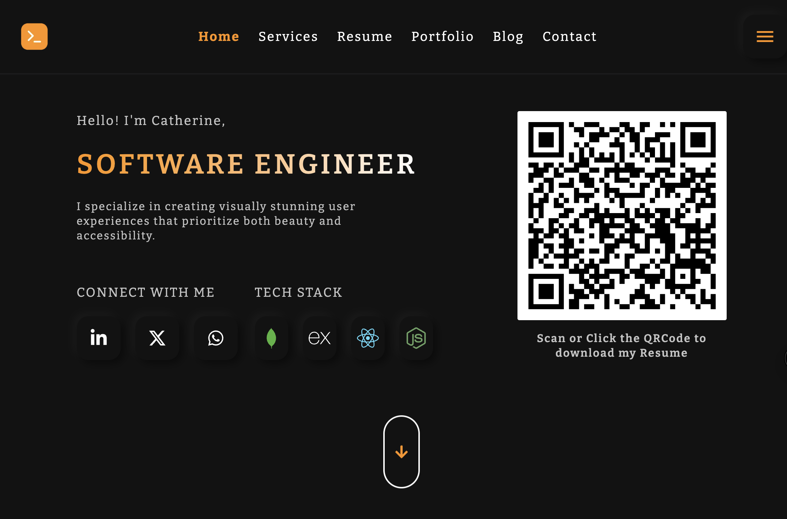

# Personal Portfolio

A clean, responsive personal portfolio showcasing my work, technical skills, and experience as a frontend developer. Built to highlight projects, share my background, and make it easy for employers and collaborators to connect with me.

## Table of Contents

- [Live Demo](#live-demo)
- [Features](#features)
- [Technologies Used](#technologies-used)
- [Installation](#installation)
- [License](#license)

## Live Demo

[Visit My Portfolio](https://design-portfolio-woad.vercel.app/)

#### Homepage


## Features

- Clean, modern UI with smooth animations
- Fully responsive design
- Dynamic project showcase
- Contact form with email integration

---

## Technologies Used

- **Next.js** – React Framework
- **TypeScript** - Business logic
- **Tailwind CSS** – Styling
- **Embla Carousel React** – Animations
- **EmailJS** – Contact form handling
- **Vercel** – Deployment

---

## Installation

1. **Clone the repository**
   ```bash
   git clone https://github.com/esthercate/Design-portfolio.git
   cd design-portfolio
  
2. Install dependencies
   ```bash
   pnpm install

3. Run the development server
   ```bash
   pnpm dev

4. Visit
   ```arduino
   http://localhost:3000

## License

This project is licensed under the **MIT License** – see the [LICENSE](LICENSE) file for details.

## Connect with Me

- [LinkedIn](https://www.linkedin.com/in/catherine-vuthi-ba18aa179/)